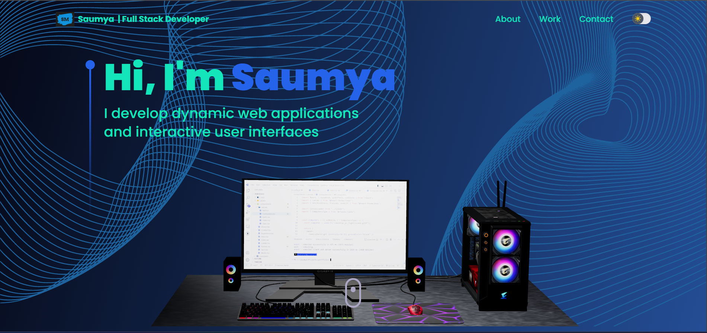

<a name="readme-top"></a>
<div align="center">

  <h1>Portfolio</h1>
  
  <p>
    A modern UI/UX and functional Developer Portfolio Web built with React & Three.js
  </p>
   
</div>

<br />

<!-- Table of Contents -->
<details>

<summary>

# :notebook_with_decorative_cover: Table of Contents

</summary>

- [:notebook\_with\_decorative\_cover: Table of Contents](#notebook_with_decorative_cover-table-of-contents)
  - [:star2: About the Project](#star2-about-the-project)
    - [:bangbang: Folder Structure](#bangbang-folder-structure)
    - [:space\_invader: Tech Stack](#space_invader-tech-stack)
  - [:toolbox: Getting Started](#toolbox-getting-started)
    - [:gear: Installation](#gear-installation)
      - [Step 1:](#step-1)
      - [Step 2:](#step-2)
      - [Step 3:](#step-3)
      - [Step 4:](#step-4)
      - [Step 5:](#step-5)
    - [:running: Run Locally](#running-run-locally)
      - [Step 1:](#step-1-1)
      - [Step 2:](#step-2-1)
  - [:handshake: Contact](#handshake-contact)
  - [:gem: Acknowledgements](#gem-acknowledgements)

</details>  

<!-- About the Project -->
## :star2: About the Project

<div align="center">
  
</div>

<br />

This repository houses an well-designed and functional Developer Portfolio Website consisting Navbar, Hero, Overview, Work Experience, Technologies, Projects, Testimonials and Contact sections built with React & Three.js using TailwindCSS ⏭

<!-- Folder Structure -->
### :bangbang: Folder Structure

Here is the folder structure of this website.
```bash
portfolio/
|- assets/
|- components/
  |-- canvas/
|- constants/
|- hoc/
|- pages/
  |-- _app.tsx
  |-- _document.tsx
  |-- index.tsx
|- public/
|- styles/
|- types/
|- utils/
|- next.config.js
|- postcss.config.js
|- tailwind.config.js
|- tsconfig.config.js
```
<br />

<!-- TechStack -->
### :space_invader: Tech Stack

[](https://skillicons.dev)

<p align="right">(<a href="#readme-top">back to top</a>)</p>

<!-- Getting Started -->
## :toolbox: Getting Started

<!-- Installation -->
### :gear: Installation

#### Step 1:
Download or clone this repo by using the link below:

```bash
 https://github.com/saumya11mehta/portfolio
```

#### Step 2:

portfolio uses NPM (Node Package Manager), therefore, make sure that Node.js is installed by execute the following command in console:

```bash
  node -v
```

#### Step 3:

At the main folder execute the following command in console to get the required dependencies:

```bash
  npm install
```

#### Step 4:

At the main folder execute the following command in console to creates a build directory with a production build of 3d portfolio:

```bash
  npm run build
```

#### Step 5:

At the main folder execute the following command in console to run the server:

```bash
  npm run start
```

<!-- Run Locally -->
### :running: Run Locally

#### Step 1:

At the main folder execute the following command in console to get the required dependencies:

```bash
  npm install
```

#### Step 2:

At the main folder execute the following command in console to run the development server:

```bash
  npm run dev
```

<p align="right">(<a href="#readme-top">back to top</a>)</p>

<!-- Contact -->
## :handshake: Contact

Saumya Mehta

Project Link: [https://github.com/saumya11mehta/portfolio](https://github.com/saumya11mehta/portfolio)

<p align="right">(<a href="#readme-top">back to top</a>)</p>

<!-- Acknowledgments -->
## :gem: Acknowledgements

This section used to mention useful resources and libraries that used in 3D Portfolio

 - [Email JS](https://www.emailjs.com/)
 - [Framer Motion](https://www.framer.com/motion/)
 - [React Parallax Tilt](https://www.npmjs.com/package/react-parallax-tilt)
 - [React Vertical Timeline Component](https://www.npmjs.com/package/react-vertical-timeline-component)
 - #JSMastery

<p align="right">(<a href="#readme-top">back to top</a>)</p>

<p align="center">

</p>
